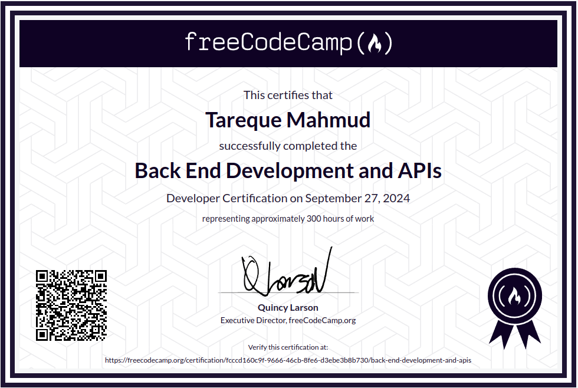
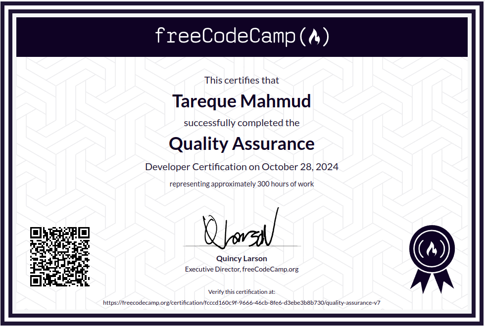

# Hi there 👋

## Welcome to My Coding Zone....

I am Tareque Mahmud, an aspiring Full Stack Web Application Developer from Bangladesh.

:hearts: &emsp;I enjoy programming and help other learn to code  
:computer: &emsp;Most used line of code `console.log("hello world")`  
:e-mail: &emsp;How to reach me: tarequemahmud313@gmail.com. 

<!--
**TarequeMahmud/TarequeMahmud** is a ✨ _special_ ✨ repository because its `README.md` (this file) appears on your GitHub profile.

Here are some ideas to get you started:

- 🔭 I’m currently working on ...
- 🌱 I’m currently learning ...
- 👯 I’m looking to collaborate on ...
- 🤔 I’m looking for help with ...
- 💬 Ask me about ...
- 📫 How to reach me: ...
- 😄 Pronouns: ...
- ⚡ Fun fact: ...
-->

:coffee: &emsp;Connect with me!

  

### <b>Things I code with</b>

       <!---->    

### 🏆 Professional Certifications

#### JavaScript Algorithms and Data Structures Certification (freeCodeCamp)

This is a hardworking certification I have obtained from FreeCodeCamp. I have to do `23 projects` that was in the learning path, from Algorithmic thinking to simple Game Development. Then I have to do 5 certification projects that are included:

1. [**Palindrome Checker**](https://github.com/TarequeMahmud/palindrome-checker.git): Developed a function to check if a string reads the same backward as forward.
2. [**Roman Numeral Converter**](https://github.com/TarequeMahmud/roman-numeral-converter.git): Created a function to convert numbers to Roman numerals.
3. [**Pokémon Search App**](https://github.com/TarequeMahmud/pokemon-search-app.git): Built an application to search for and display information about different Pokémon using an external API.
4. [**Telephone Number Validator**](https://github.com/TarequeMahmud/validatePhone.git): Built a validator to verify if the input matches the format of a U.S. phone number.
5. [**Cash Register**](https://github.com/TarequeMahmud/cash-register.git): Created a cash register that returns appropriate change.

#### Backend Development and APIs Certification (freeCodeCamp)

I have achieved this certificate from FreeCodeCamp after a lots of hardwork. After going through a learning path, where I learnt **NodeJs**, **Express.js**, **MongoDB**, **Mongoose** and **Debugging** I had to complete 5 do-yourself certification projects. Projects included:

1. [**Timestamp Microservice**](https://github.com/TarequeMahmud/timestamp-microservice-fcc.git): Built a microservice that returns date/time information based on user input.
2. [**Request Header Parser Microservice**](https://github.com/TarequeMahmud/headerparser-fcc.git): Created a service that parses and returns user request header information.
3. [**URL Shortener**](https://github.com/TarequeMahmud/url-shortener.git): Developed a system to generate shorter URLs for easier reference.
4. [**Exercise Tracker**](https://github.com/TarequeMahmud/excercise-tracker-api.git): Implemented an application to log and track user exercises.
5. [**File Metadata Microservice**](https://github.com/TarequeMahmud/file-metadata-microservice.git): Created a microservice that accepts a file upload and returns metadata about the file.

#### Quality Assurance Certification (freeCodeCamp)

I've achieved the Quality Assurance Certification from freeCodeCamp, adding new skills through hands-on experience with project-based learning, including **Passport.js**, **Socket.io**, **Advanced Node and Express**, and **Mocha and Chai** for testing. Here are the certification projects I completed:

1. [**Metric-Imperial Converter**](https://github.com/TarequeMahmud/metric-imperial-converter.git): Developed a converter for units of measurement between the metric and imperial systems.
2. [**Issue Tracker**](https://github.com/TarequeMahmud/issue-tracker.git): Built an issue tracker that allows users to report, modify, and track issues.
3. [**Personal Library**](https://github.com/TarequeMahmud/personal-library.git): Created a library application to add, remove, and track books.
4. [**Sudoku Solver**](https://github.com/TarequeMahmud/sudoku-solver.git): Implemented a logic-based solution to solve and verify Sudoku puzzles.
5. [**American British Translator**](https://github.com/TarequeMahmud/british-american-translator.git): Developed a tool to translate between American and British English.

Check out these projects to see my work in Quality Assurance and software testing practices.
