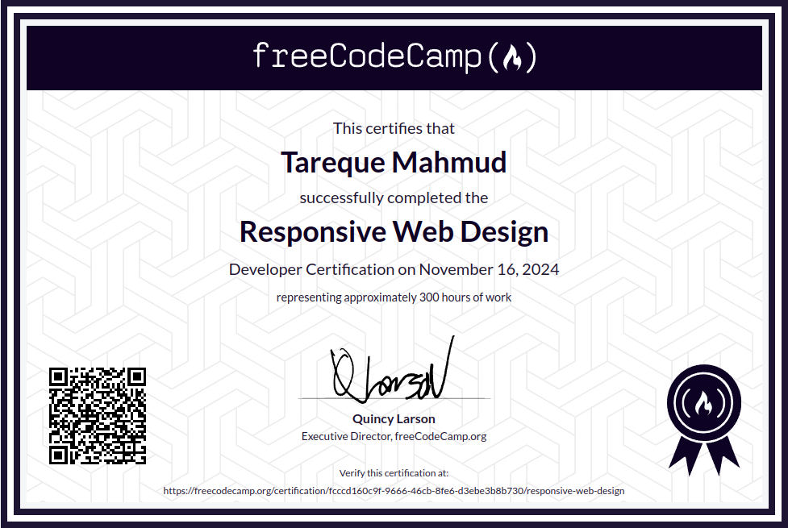

# Hi there 👋

## Welcome to My Coding Zone....

I am Tareque Mahmud, an aspiring Full Stack Web Application Developer from Bangladesh.

:hearts: &emsp;I enjoy programming and help other learn to code  
:computer: &emsp;Most used line of code `console.log("function working")`  
:e-mail: &emsp;How to reach me: tarequemahmud313@gmail.com. 

<!--
**TarequeMahmud/TarequeMahmud** is a ✨ _special_ ✨ repository because its `README.md` (this file) appears on your GitHub profile.

Here are some ideas to get you started:

- 🔭 I’m currently working on ...
- 🌱 I’m currently learning ...
- 👯 I’m looking to collaborate on ...
- 🤔 I’m looking for help with ...
- 💬 Ask me about ...
- 📫 How to reach me: ...
- 😄 Pronouns: ...
- ⚡ Fun fact: ...
-->

:coffee: &emsp;Connect with me!

  

###  <b> Things I code with</b>

---

## 🚀 All My Projects

### Full Stack Projects

| Project Name                                                        | Description                                                                                                                                                                                                                                  | Tech Stack                                                                                                                                                                   |
| ------------------------------------------------------------------- | -------------------------------------------------------------------------------------------------------------------------------------------------------------------------------------------------------------------------------------------- | ---------------------------------------------------------------------------------------------------------------------------------------------------------------------------- |
| [MediChoice.AI](https://github.com/TarequeMahmud/medichoice.ai.git) | An AI-driven medical recommendation system that helps users find the best treatment options based on symptoms and conditions.                                                                                                                | NestJS, PostgreSQL, TypeORM, Gemini Api, Next.js, Redux, Tailwind, Redis, Passport.js, JWT, Jest, SuperTest, Swagger (OpenAPI), GitHub Actions (CI/CD), Docker, JIRA (Scrum) |
| [Vox](https://github.com/TarequeMahmud/vox.git)                     | An AI-powered real-time chat application that enables interactive conversations with intelligent responses using Gemini AI.                                                                                                                  | Next.js, Redux, PostgreSQL, Tailwind, Redis, JWT, Github Actions(CI/CD), Vercel and Docker                                                                                   |
|                                                                     |
| [CollabTask](https://github.com/TarequeMahmud/CollabTask.git)       | A project management platform designed to streamline team collaboration, task tracking, and productivity management.                                                                                                                         | MongoDB, Express, React, SCSS, Node.js, PassportJs                                                                                                                           |
| [Intellibrary](https://github.com/TarequeMahmud/Intellibrary.git)   | An AI based book review application where users can create a book profile and Commit CRUD operation. It has an Analyze With AI feature to get recommendations, get info and take suggestions from the bookshelf and choose appropriate books | React, Tailwind, Node, Express, MongoDB, Gemini API                                                                                                                          |

### Backend APIs and Microservices

[NodeJS, ExpressJs, MongoDB, PassportJs, Socket.io etc.]

| Project Name                                                                                              | Project Description                                    |
| --------------------------------------------------------------------------------------------------------- | ------------------------------------------------------ |
| [Timestamp Microservice](https://github.com/TarequeMahmud/timestamp-microservice-fcc)                     | A service to parse and return date and time.           |
| [Request Header Parser Microservice](https://github.com/TarequeMahmud/request-header-parser-microservice) | A microservice to extract and display request headers. |
| [URL Shortener Microservice](https://github.com/TarequeMahmud/url-shortener-microservice)                 | A service to shorten and redirect URLs.                |
| [Exercise Tracker](https://github.com/TarequeMahmud/exercise-tracker)                                     | An app to log and track user exercises.                |
| [File Metadata Microservice](https://github.com/TarequeMahmud/file-metadata-microservice)                 | A service to retrieve file metadata.                   |
| [Metric-Imperial Converter](https://github.com/TarequeMahmud/metric-imperial-converter)                   | A tool to convert between metric and imperial units.   |
| [Issue Tracker](https://github.com/TarequeMahmud/issue-tracker)                                           | A web app to log and manage issues.                    |
| [Personal Library](https://github.com/TarequeMahmud/personal-library)                                     | A service to manage a collection of books.             |
| [Sudoku Solver](https://github.com/TarequeMahmud/sudoku-solver)                                           | A tool to solve Sudoku puzzles programmatically.       |
| [American British Translator](https://github.com/TarequeMahmud/british-american-translator)               | A translator for American and British English.         |

---

## 📊 GitHub Activity Overview – _Tareque Mahmud_

  <!-- Profile Summary Card -->
  

  <!-- GitHub Streak Stats -->
  

  <!-- GitHub Stats and Top Languages Side-by-Side -->
  

  

  <!-- Contribution Graph -->
  

---

## 🏆 Professional Certifications

#### Responsive Web Design Certification (freeCodeCamp)

This **Responsive Web Design Certification** involved designing and building _20 responsive web projects_, including five certification projects that showcase mastery of modern HTML and CSS techniques.

#### JavaScript Algorithms and Data Structures Certification (freeCodeCamp)

This is a hardworking certification I have obtained from FreeCodeCamp. I have to do `23 projects` that was in the learning path, from Algorithmic thinking to simple Game Development.

#### Backend Development and APIs Certification (freeCodeCamp)

I have achieved this certificate from FreeCodeCamp after a lots of hardwork. After going through a learning path, where I learnt **NodeJs**, **Express.js**, **MongoDB**, **Mongoose** and **Debugging**.

#### Quality Assurance Certification (freeCodeCamp)

I've achieved the Quality Assurance Certification from freeCodeCamp, adding new skills through hands-on experience with project-based learning, including **Passport.js**, **Socket.io**, **Advanced Node and Express**, and **Mocha and Chai** for testing.
